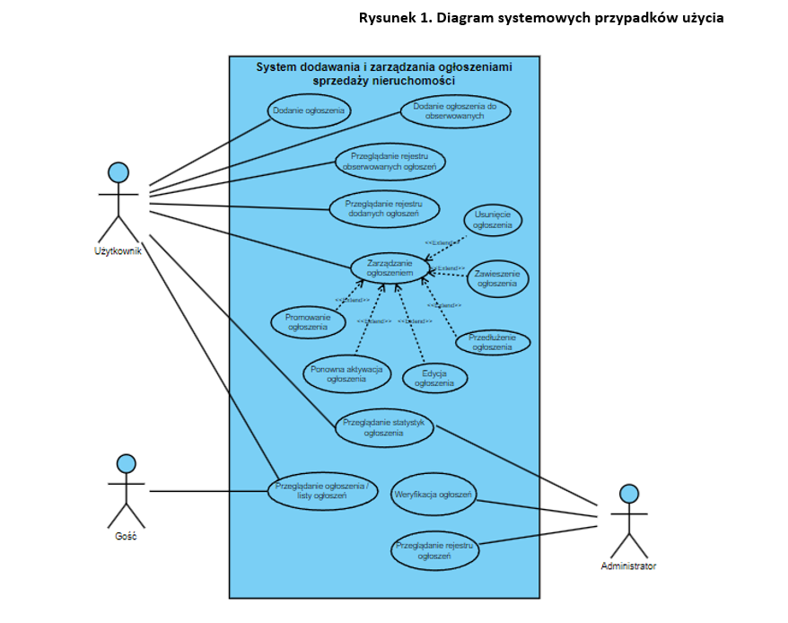
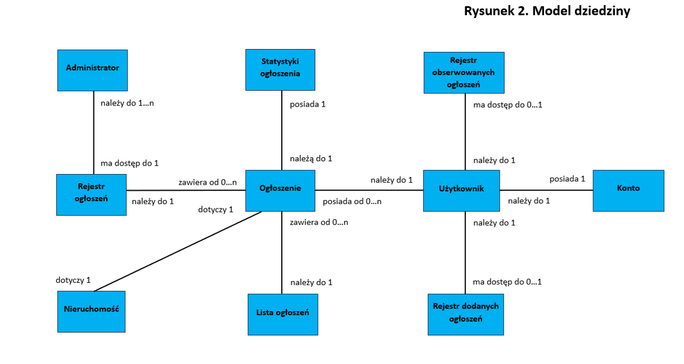
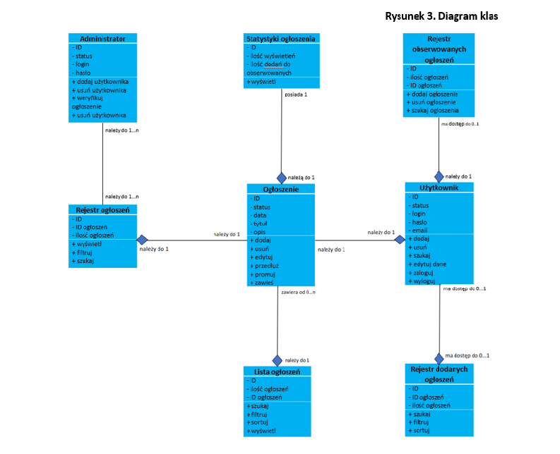
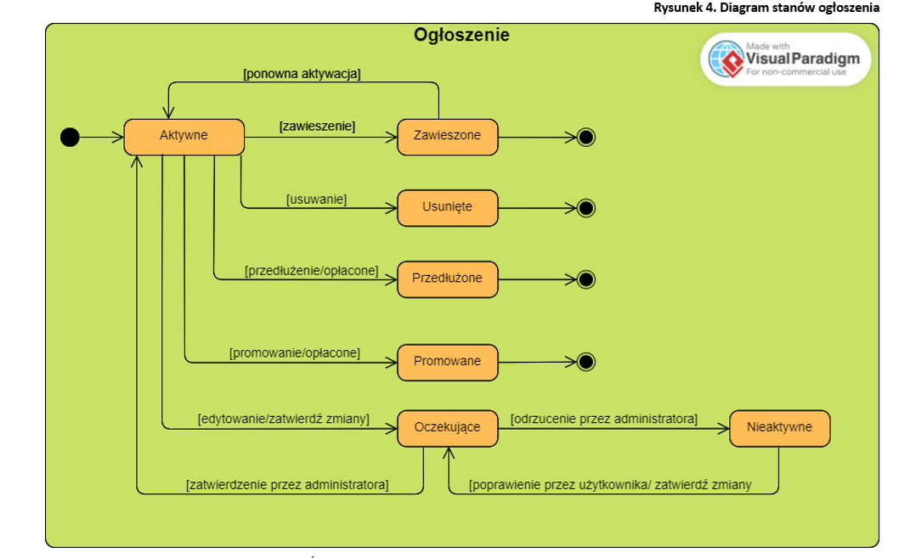
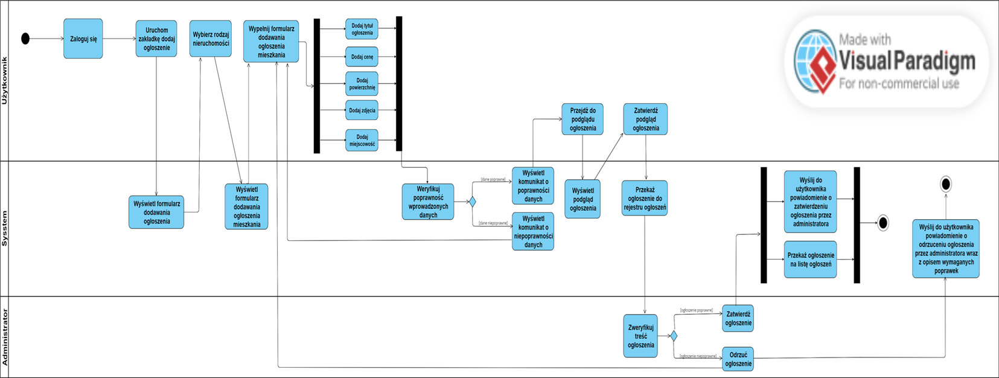

# UML-property-sales-portal-project
System analysis of a tool for managing advertisements on property sales portal, using UML.

It contains use case diagram, domain model, class diagram, state diagram and activity diagram.

## 📌 Diagrams

### 1. Use Case Diagram
  
[📄 PDF](diagrams/pdf/use_case_diagram.pdf) 

---

### 2. Domain model
  
[📄 PDF](diagrams/pdf/domain_model.pdf) 

---

### 3. Class Diagram
  
[📄 PDF](diagrams/pdf/class_diagram.pdf) 

---

### 4. State Diagram
  
[📄 PDF](diagrams/pdf/state_diagram.pdf) 

---

### 5. Activity Diagram
  
[📄 PDF](diagrams/pdf/activity_diagram.pdf) 

### 5. Activity Diagram
  
[📄 PDF](diagrams/pdf/activity_diagram.pdf) 
